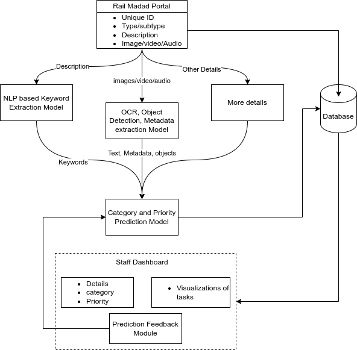

### Problem Statement ID: 
SIH1711

### Problem Statement Title: 
Enhancing Rail Madad with Al-powered Complaint Management

### Proposed Solution:

The proposed solution will operate on data submitted by users, same as the existing Rail Madad Portal.​
  

The key data associated with each complaint will include details of the station/train, type and subtype of the complaint, description, image/video/audio.​
  

The description will be processed by an NLP model to extract important keywords. Images will be processed by object recognition and OCR models to extract keywords and metadata (e.g., timestamp, location). Based on these keywords, metadata, and other complaint details, the categorization and priority prediction model will determine the priority and category of the complaint and assign it to the correct department. To improve the speed of complaint resolution, a staff dashboard will provide visual analysis and task-tracking features.​
  

Since this solution will be available as an API, it will be easy to integrate with the existing Rail Madad portal. Data will be stored in a central database and used to train models, which will run on a microservice architecture to enhance scalability and minimize downtime. A feedback mechanism will also be implemented, where incorrect department or priority predictions, or poor resolution performance, can be reported to the system. This feedback will help improve model accuracy through periodic retraining using reinforcement learning.​
  

Given the vast corpus of data that will be available, it will be used to predict trends in complaints to prevent recurring issues or notify users of unavoidable issues and expected resolution times on the portal. This data will also be analyzed to train staff to resolve issues more effectively and quickly.​

​

